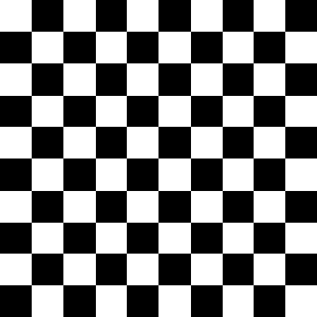
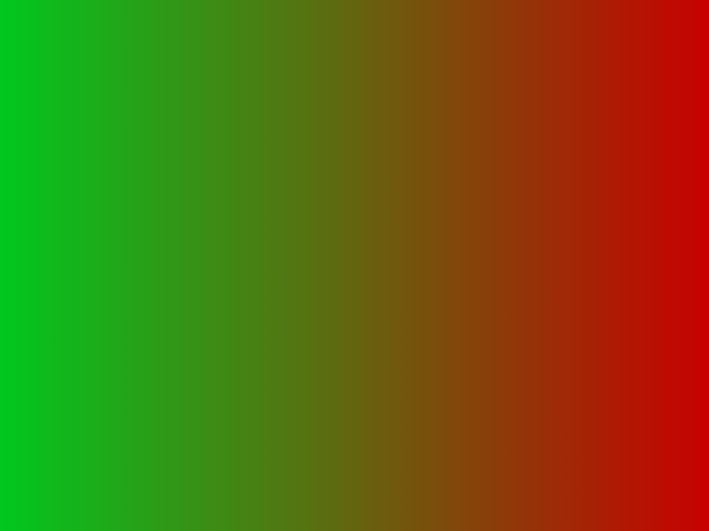
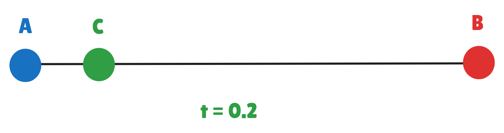

## Introdução

O projeto que desenvolveremos ao longo do primeiro dia servirá como uma introdução aos conceitos mais fundamentais que utilizaremos ao longo dos próximos dias. Antes de nos dedicarmos a desenhar algo na tela, escolher sua cor ou sua posição, precisamos entender como tudo isso se encaixa e como que a partir de linhas de código, conseguimos abstrair todos esses conceitos que parecem naturais para nós, como cor, formato e posição.

### Cores no Computador (RGB)

A maneira clássica de se lidar com cores no computador é utilizando o modelo RGB, que significa Red, Green and Blue, ou seja vermelho, verde e azul. Nesse formato, uma cor é formada por 3 valores, com cada valor estando dentro do intervalo \[0,255\]. Cada valor, então, indica o quanto de vermelho, verde ou azul está presente na cor que queremos representar. De maneira simples, podemos codificar isso utilizando uma 3-Tupla, ou seja, uma Struct, com 3 valores inteiros no intervalo \[0, 255\].

Nesse projeto, vamos fazer algumas mudanças nisso, transformaremos o intervalo inteiro \[0, 255\] no intervalo real \[0,1\]. Isso pode ser feito dividindo o valor por 255.

#### Implementando a classe RGBColor

Como a Struct RGBColor que criaremos será utilizada por, basicamente, todas as partes do projeto, a criaremos num arquivo  chamado`common.hpp` na raiz do `src` nosso projeto.

```cpp
struct RGBColor {

/*
atributos...
constructors...
destructors...
*/

/*Operações entre cores RGB*/

RGBColor operator+(const double& c) const {return RGBColor(/*TODO*/);}
RGBColor operator*(const double& t) const {return RGBColor(/*TODO*/);}
RGBColor operator/(const double& t) const {return RGBColor(/*TODO*/);}

RGBColor operator+(const RGBColor& c) const {return RGBColor(/*TODO*/);}
RGBColor operator*(const RGBColor& c) const {return RGBColor(/*TODO*/);}
RGBColor operator/(const RGBColor& c) const {return RGBColor(/*TODO*/);}

bool operator==(const RGBColor& c) const {return /*TODO*/};

double&    operator[](const size_t index){
if(index == 0)return /*TODO*/;
if(index == 1)return /*TODO*/;
return /*TODO*/;
};
}
```

<!-- Aqui, cabe no material principal uma pequena seção para explicar o que é um Pixel -->
### Representando uma Imagem com Cores (PPM)

Agora que sabemos como representar uma cor, precisamos de uma maneira de utilizá-la para representar uma imagem. Uma maneira possível (e a que iremos utilizar ao longo do curso) é utilizando o formato de imagem PPM (Portable Pixmap Format). O formato PPM trata a imagem como uma matriz ou um "grid", em que cada pixel da imagem é uma posição nessa matriz. Chamamos de PPM3 quando utilizamos RGB no formato PPM.

#### Formato PPM3

Uma imagem no formato PPM3 é apenas um arquivo de texto com a extensão `.ppm`, que segue o seguinte formato:

```text
P3           # Indica que é uma imagem com cores em RGB em ASCII
3 2          # Indica largura e altura da imagem em pixels
255 		 # Indica o valor máximo do PPM
# Tudo abaixo disso é o corpo da imagem
255   0   0  # vermelho
  0 255   0  # verde
  0   0 255  # azul
255 255   0  # amarelo
255 255 255  # branco
  0   0   0  # preto
```

#### Exportando uma imagem como PPM3

Agora que sabemos que temos a struct RGBColor e sabemos o funcionamento do formato PPM, podemos entender e codar a transformação de um vetor de RGBColor para uma imagem ppm.

Sabendo do formato PPM que vimos na seção anterior, podemos imaginar como isso pode ficar em C++:

```cpp
static bool exportPPM3 (const std::string& filename,
						const std::vector<RGBColor>& buffer,
						const int& img_width,
						const int& img_height){
					
	std::ofstream ofs(filename);
				
	if (!ofs.is_open()) {
        std::cerr << "Error on create the file " + filename << '\n';
        return false;
    }
	/*
	TODO
	*/
	
	ofs.close()
	return true;
};
```

### Onde desenharemos tudo?

Para que possamos desenhar algo num plano e exportar o que for desenhado para PPM, precisamos primeiro definir aonde desenharemos tudo. Esse lugar no qual desenharemos é chamado de Canvas, ou seja, um quadro branco que preencheremos com cores e formas, para que possamos então exportá-lo como imagem.

#### Implementando a Class Canvas
Para isso precisaremos criar a Class Canva, que terá como atributos o nome do arquivo que será exportado a partir dele, o vetor de RGBColor, a largura, altura e tipo da imagem.

```cpp
using Point2 = vec2<int>;
using Pixel = Point2;

class Canvas {

	private:
	/*atributos*/

	public:
	/*
	constructors
	destructors
	getters
	*/

	/**
	* @brief Função que desenha um pixel na imagem
	* @param pixel Posição do pixel desenhado.
	* @param color Nova cor do pixel.
	*/
	void add(const Pixel& pixel, const RGBColor& color){
		/*TODO*/
		/*Dica: Pixel é apenas um vetor de 2 posições (x,y)*/
	}

	/**
	* @brief Função que exporta a imagem armazenada
	* @details Utilizando o parâmetro imgType passado pelo construtor, ela define qual o formato da imagem.
	*/
	bool export_img() const {
		/*TODO*/
	}
}
```

### Criando um Background

Antes de começarmos a desenhar formas como linhas e circulos, precisamos pintar o plano de fundo do nosso canvas. Isso vai melhorar a visualização dos nossos futuros desenhos, afinal, imagine o quão dificil deve ser tentar pintar em um quadro transparente!

#### Implementando o Background

Implementar a classe background, vai ser, futuramente, a nossa maneira de falar para o Canvas de qual cor ele deve pintar cada pixle da imagem antes de desenhar todo o resto.

Primeiro codaremos nosso `.hpp`:

```cpp
class Background {
	private:
		RGBColor m_color;
	
	public:
		Background(RGBColor color) : m_color(color) {};

		/**
		* @brief Função que retornada qual a cor deve ser pintada determinada posição do Canvas
		*/
		RGBColor sample(double u, double v) const;
}
```

Agora, precisamos apenas implementar a função `sample` no nosso `.cpp`:

```cpp
RGBColor Background::sample(double, double) const {
/*TODO*/
}
```

A estrutura do nosso código para o background parece muito complicada para esse plano de fundo simples de uma cor só, mas com os próximos exercícios você perceberá que essa organização facilitará a implementação de novos padrões de background!

### Juntando tudo e Gerando a primeira imagem PPM!

Para gerar a imagem PPM, vamos juntar todas as peças desenvolvidas aqui até agora. O desafio será gerar uma imagem PPM 40x40 com a cor magenta (mistura de azul e vermelho exclusivamente). 

Para fazer isso será necessário:

1. Iniciar um canvas com 40 de largura e 40 e altura
2. Iniciar um background com a cor magenta
3. Exportar a imagem para PPM, se atentando ao cabeçalho e a divisão de pixels


### Exercícios

Com todo os conhecimentos que adquirimos hoje, temos alguns desafios que gostariamos que vocẽs tentassem resolver, algumas coisinhas novas podem aparecer, mas ajudaremos com qualquer dúvida que aparecer!

#### Implementação de um plano de fundo xadrez

O primeiro desafio será implementar o plano de fundo xadrez. Ele precisará de duas cores principais e o tamanho do lado dos quadrados.

```cpp
class CheckerboardBackground : public Background {
	private:
	RGBColor m_color2;
	double m_square_side;
	/*atributos e construtoresexclusivos da classe CheckerboardBackground*/
	public:
	CheckerboardBackground(RGBColor color1, RGBColor color2, double square_side = 0.1) : m_color(color1), m_color2(color2), m_square_side(square_side) {};

	/**
	* @brief Função que retorna qual a cor do background nas coordenadas (u, v)
	*/
	RGBColor sample(double u, double v) const override;
}
```
O objetivo final será criar uma imagem como essa.
<div  class="figure"  style="flex: 1; text-align: center;">



<p  style="margin: 0.5rem auto 0; text-align: center;"><em><br  /></em></p>

</div>

#### Implementação de um plano de fundo com gradiente

O próximo desafio será gerar a seguinte imagem

<div  class="figure"  style="flex: 1; text-align: center;">



<p  style="margin: 0.5rem auto 0; text-align: center;"><em><br  /></em></p>

</div>
Para fazer isso, é preciso entender alguns conceitos previamente.

##### Interpolação linear.

Escolha dois pontos $A$ e $B$ em uma reta. Entre esses dois pontos coloque um ponto intermediário $C$ na reta. É possível atribuir um valor $t \in [0, 1]$ tal que, se $C = A$ então $t = 0$, se $C = B$ então $t = 1$. Quanto mais próximo $C$ estiver de $B$, mais próximo $t$ estará de $1$.
<div  class="figure"  style="flex: 1; text-align: center;">



<p  style="margin: 0.5rem auto 0; text-align: center;"><em>t=0.2 pois C está 20% da distância total até B<br/></em></p>

</div>

Usando a ideia desse valor $t$ é possível criar uma função que faz a média entre a intensidade de duas cores em uma reta.
##### Função da média ponderada para a interpolação linear

$P(t) = A (1-t) + B t$

Com essa função, é possível encontrar uma cor média entre duas cores em extremos diferentes. Para fazer isso, é preciso realizar a operação de multiplicação por $t$ para cada canal de cor RGB. Seguindo essa ideia, a imagem exemplificada pode ser gerada.

```cpp
class GradientBackground : public Background {
	private:
	/*atributos e construtores que você achar necessário*/
	public:
	GradientBackground(/*TODO*/);

	/**
	* @brief Função que retorna qual a cor do background nas coordenadas (u, v)
	*/
	RGBColor sample(double u, double v) const override;
}
```
